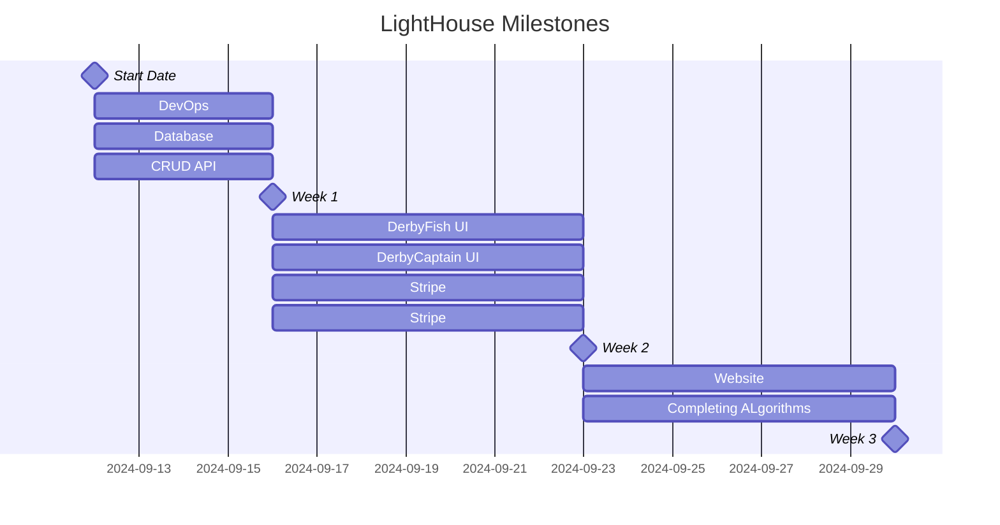

# Derby.Fish
# Milestones

### Derby.Fish Lighthouse
Derby.Fish Lighthouse is the name of the very first functional version of the Derby.Fish suite of software products
- DerbyFish API
- DerbyFish Native
- DerbyFish Captain

The Derby.Fish development team plans to complete a prototype version of Lighthouse prior to October 1st.
  
# Derby.Fish API
## Description

The Derby.Fish API server is the central component of the Derby.Fish software suite, acting as the main interface for all interactions with the underlying database. All operations related to data management and user interactions are channeled through this API server.

When a user submits a request through the API, the server first authenticates the user to ensure they have the appropriate permissions. Once authentication is successfully completed, the server processes the request, which may involve creating new posts, updating existing submissions, or modifying user profiles.

By centralizing database interactions through the API server, we provide a secure and consistent way to handle user commands and ensure that all actions are properly authorized and executed.
Key Features

- Authentication: Validates user identity before processing any requests.
- Command Execution: Handles a variety of user commands, including creating and updating posts, and modifying user profiles.
- Centralized Data Management: Manages all database interactions through a single API endpoint to maintain consistency and security.

For more details, visit our GitHub repository: AGFarms/derbyfish-api

# Derby.Fish Native
## Description

Derby.Fish Native is the primary client interface for interacting with the Derby.Fish suite of software products. It is built using Expo Go, enabling it to target iOS, Android, and web platforms simultaneously. This cross-platform approach ensures a seamless and consistent user experience across different devices.

As the main client application, Derby.Fish Native provides users with an intuitive and engaging interface to access and manage their Derby.Fish account, interact with various features, and execute commands. Whether on a mobile device or a web browser, users can efficiently navigate through their profiles, view and create posts, and perform other key functions of the Derby.Fish ecosystem.
Key Features

- Cross-Platform Compatibility: Available on iOS, Android, and web, offering a unified experience across all devices.
- User Interface: Provides an intuitive and responsive design tailored for easy interaction with the Derby.Fish suite.
- Seamless Integration: Connects smoothly with the Derby.Fish API to ensure real-time data synchronization and functionality.

For more information and to view the codebase, visit our GitHub repository: derbyfish-native.

# Derby.Fish Captain
## Description

Derby.Fish Captain is the comprehensive admin console for the Derby.Fish suite of software products. Designed specifically for administrative use, this tool empowers administrators with robust capabilities to manage and oversee the entire Derby.Fish ecosystem.

Through Derby.Fish Captain, admins can efficiently handle a variety of tasks including the creation, deletion, and updating of leagues and derbies. It also includes advanced CRM features to facilitate the management of user interactions and support. Additionally, the console integrates with Stripe to streamline onboarding processes for leagues and derbies, enabling seamless payment processing and financial management.
Key Features

- League and Derby Management: Create, update, and delete leagues and derbies with ease.
- CRM Capabilities: Access and manage customer relationship data to improve user engagement and support.
- Stripe Integration: Onboard leagues and derbies with Stripe for efficient payment processing and financial operations.

For more details and to access the codebase, visit our GitHub repository: derbyfish-captain.

# Online Tools
## Github
GitHub is an integral part of our development workflow, serving as the platform where we track progress and milestones for our various codebases. It provides a centralized location for managing our projects, facilitating collaboration, and ensuring transparency throughout the development process.

Key Uses of GitHub:

Progress Tracking: GitHub allows us to monitor the progress of each feature and project through issues, pull requests, and project boards. This helps keep everyone on the same page and ensures that development is moving forward according to our plans.

Milestones Management: We use GitHub to set and track milestones for key features and releases. This helps us manage deadlines and ensures that we are meeting our development goals in a timely manner.

Multistep Development Process: Every feature undergoes a structured, multistep process before being integrated into the main application. This process includes:
- Feature Planning: Initial discussion and planning, tracked through GitHub Issues and Project Boards.
- Development: Code is developed in feature branches, with progress monitored through pull requests.
- Review: Code reviews and testing are conducted through pull requests to ensure quality and functionality.
- Integration: Approved features are merged into the main branch after thorough testing and review.
- Deployment: Final integration and deployment to production are managed and tracked through GitHub’s deployment tools.

By leveraging GitHub’s tools and features, we ensure a smooth and efficient development cycle, maintain high code quality, and achieve our project milestones effectively.

For more information and to explore our repositories, visit our GitHub organization.

## Supabase

Supabase plays a crucial role in our infrastructure by providing robust database management and storage solutions for our application. We use Supabase in two distinct environments to ensure smooth development and deployment processes:

- Development Environment: Our dev Supabase project is used for development and testing purposes. It allows our team to work on new features, perform experiments, and conduct thorough testing without affecting the live environment.

- Live Environment: The live Supabase project is dedicated to our production environment. This is where the application’s live data is managed, ensuring that all user interactions and media files are stored securely and reliably.

Key Features and Benefits of Supabase:

- Database Management: Supabase provides a powerful and scalable database management system that supports real-time capabilities and complex queries. It ensures that our application data is managed efficiently and can scale with our needs.

- Persistent and Trusted Storage: We use Supabase for storing all media files used within the application. Its reliable storage solutions ensure that media files are kept safe, accessible, and well-integrated with our database.

- Authentication: Supabase offers built-in authentication features, allowing us to manage user identities and permissions securely. This integration simplifies user login processes and enhances overall security.

- High Availability: Supabase is a highly available, hosted platform that provides the reliability and performance required for a professional-grade application. Its infrastructure supports our needs for continuous operation and minimal downtime.

By leveraging Supabase’s comprehensive suite of features, we ensure that our application benefits from a reliable, scalable, and secure backend infrastructure, enabling us to deliver a high-quality experience to our users.

For more information about Supabase, visit their official website.
