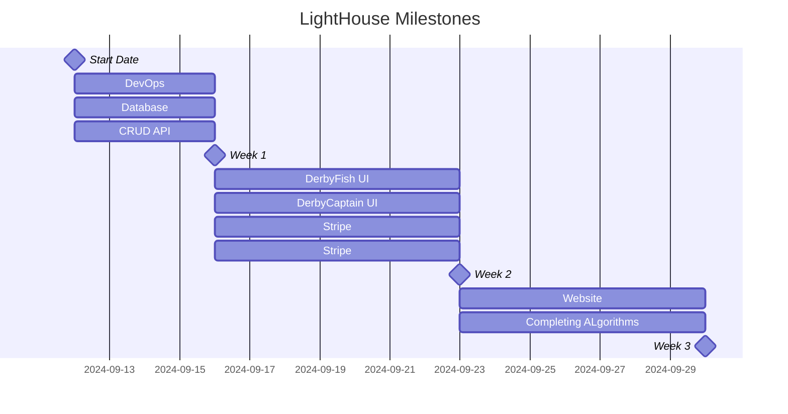

# Derby.Fish

## Milestones

### Derby.Fish Lighthouse
**Derby.Fish Lighthouse** is the name for the first working version of our software suite, which includes:
- **DerbyFish API**
- **DerbyFish Native**
- **DerbyFish Captain**

Our goal is to have a prototype of Lighthouse ready before October 1st.

## Derby.Fish API

### What It Does
The Derby.Fish API is the core of our software suite. It handles all the interactions with our database, such as managing user requests and commands. 

**How It Works:**
1. When a user makes a request, the API first checks if the user is authorized.
2. After confirming the user's identity, the API processes the request—like creating a new post or updating a profile.

**Key Features:**
- **User Authentication**: Ensures only authorized users can make changes.
- **Command Processing**: Manages tasks like creating or updating posts.
- **Centralized Management**: Handles all data through a single point.

For more information, visit our GitHub page: [DerbyFish API](https://github.com/AGFarms/derbyfish-api).

## Derby.Fish Native

### What It Does
Derby.Fish Native is the main application that users interact with. It works on iOS, Android, and web browsers, providing a consistent experience across all devices.

**How It Works:**
1. Users can access their Derby.Fish account and manage their profile.
2. It allows users to view and create posts or perform other tasks.

**Key Features:**
- **Cross-Platform**: Works on mobile devices and web browsers.
- **User-Friendly**: Easy to use with a responsive design.
- **Real-Time Updates**: Syncs smoothly with the Derby.Fish API.

For more details, visit our GitHub page: [DerbyFish Native](https://github.com/derbyfish-native).

## Derby.Fish Captain

### What It Does
Derby.Fish Captain is the admin tool used for managing the entire Derby.Fish system. It helps administrators handle various tasks like managing leagues and derbies.

**How It Works:**
1. Admins can create, update, or delete leagues and derbies.
2. Includes tools for managing customer relationships and processing payments through Stripe.

**Key Features:**
- **Admin Controls**: Manage and update leagues and derbies.
- **Customer Management**: Track and manage user interactions.
- **Payment Integration**: Set up and manage payments with Stripe.

For more information, visit our GitHub page: [DerbyFish Captain](https://github.com/derbyfish-captain).

---

This version simplifies the explanations and avoids technical jargon to make it more accessible to non-programmers.
